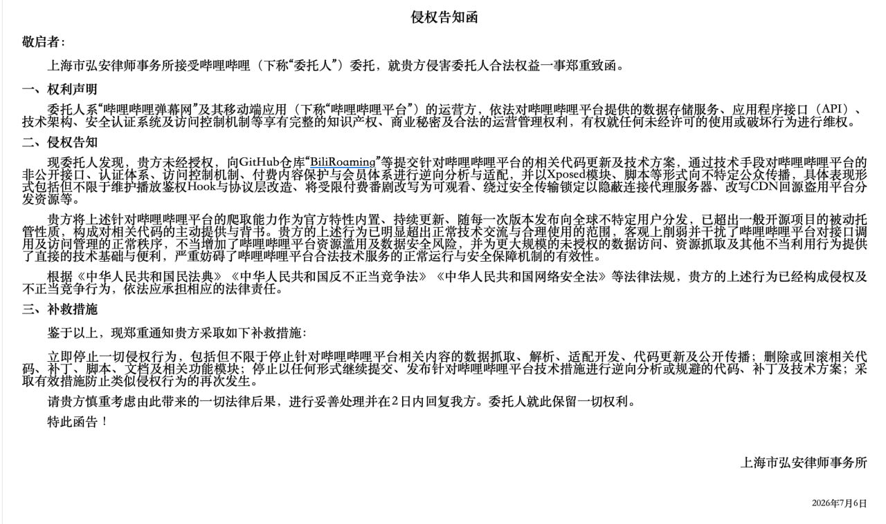

## 侵权告知函

敬启者：

上海市弘安律师事务所接受哔哩哔哩（下称“委托人”）委托，就贵方侵害委托人合法权益一事郑重致函。
### 一、权利声明

委托人系“哔哩哔哩弹幕网”及其移动端应用（下称“哔哩哔哩平台”）的运营方，依法对哔哩哔哩平台提供的数据存储服务、应用程序接口（API）、技术架构、安全认证系统及访问控制机制等享有完整的知识产权、商业秘密及合法的运营管理权利，有权就任何未经许可的使用或破坏行为进行维权。

### 二、侵权告知

现委托人发现，贵方未经授权，向GitHub仓库“BiliRoaming”等提交针对哔哩哔哩平台的相关代码更新及技术方案，通过技术手段对哔哩哔哩平台的非公开接口、认证体系、访问控制机制、付费内容保护与会员体系进行逆向分析与适配，并以Xposed模块、脚本等形式向不特定公众传播，具体表现形式包括但不限于维护播放鉴权Hook与协议层改造、将受限付费番剧改写为可观看、绕过安全传输锁定以隐蔽连接代理服务器、改写CDN回源盗用平台分发资源等。

贵方将上述针对哔哩哔哩平台的爬取能力作为官方特性内置、持续更新、随每一次版本发布向全球不特定用户分发，已超出一般开源项目的被动托管性质，构成对相关代码的主动提供与背书。贵方的上述行为已明显超出正常技术交流与合理使用的范围，客观上削弱并干扰了哔哩哔哩平台对接口调用及访问管理的正常秩序，不当增加了哔哩哔哩平台资源滥用及数据安全风险，并为更大规模的未授权的数据访问、资源抓取及其他不当利用行为提供了直接的技术基础与便利，严重妨碍了哔哩哔哩平台合法技术服务的正常运行与安全保障机制的有效性。

根据《中华人民共和国民法典》《中华人民共和国反不正当竞争法》《中华人民共和国网络安全法》等法律法规，贵方的上述行为已经构成侵权及不正当竞争行为，依法应承担相应的法律责任。

### 三、补救措施

鉴于以上，现郑重通知贵方采取如下补救措施：

立即停止一切侵权行为，包括但不限于停止针对哔哩哔哩平台相关内容的数据抓取、解析、适配开发、代码更新及公开传播；删除或回滚相关代码、补丁、脚本、文档及相关功能模块；停止以任何形式继续提交、发布针对哔哩哔哩平台技术措施进行逆向分析或规避的代码、补丁及技术方案；采取有效措施防止类似侵权行为的再次发生。

请贵方慎重考虑由此带来的一切法律后果，进行妥善处理并在2日内回复我方。委托人就此保留一切权利。

特此函告！

上海市弘安律师事务所

2026年7月6日
